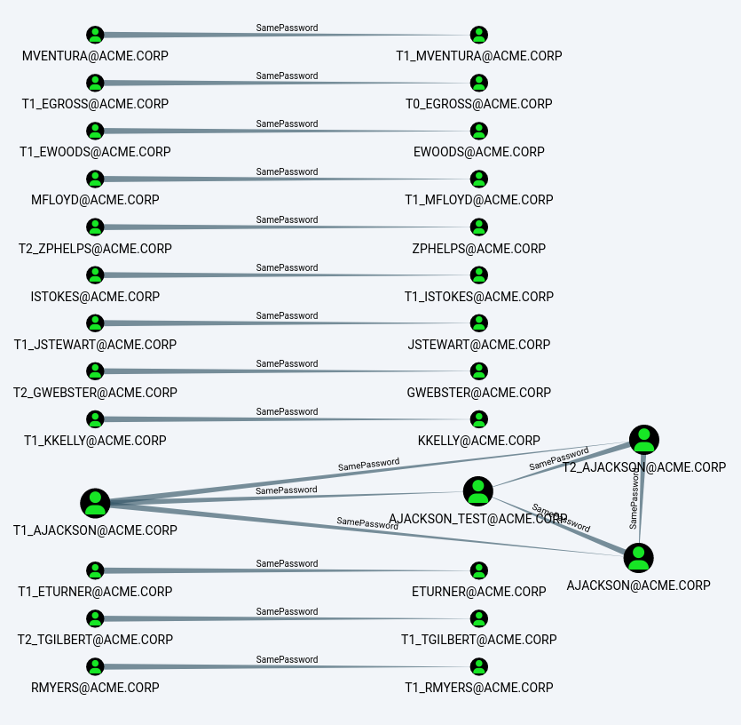

hashcathelper
=============

Convenience tool for hashcat.

Usage
-----

Run `hashcathelper -h` for help. The program is structured in subcommands.
See `hashcathelper <subcommand> -h` for more information.

### Subcommand "ntlm"

First, it bruteforces all LM hashes and uses the results to crack the
corresponding NT hashes. Then, a large wordlist (recommendation:
[Crackstation](https://crackstation.net/crackstation-wordlist-password-cracking-dictionary.htm))
is used together with a large ruleset (recommendation:
[OneRule](https://notsosecure.com/one-rule-to-rule-them-all/)) to crack all
remaining NT hashes. The list of account names is prepended to the wordlist,
as hashcat does not automatically check if the account name is the password.

The pwdump format is the one which is used by
[secretsdump](https://github.com/SecureAuthCorp/impacket/blob/master/impacket/examples/secretsdump.py)
or Meterpreter's
[hashdump](https://www.offensive-security.com/metasploit-unleashed/meterpreter-basics/)
function.

Example:

```
$ hashcathelper ntlm dc01.ntds
```

### Subcommand "analytics"

Output interesting statistics about the cracked passwords. It is meant to be
used together with the output of the `ntlm` subcommand, but passwords which
were obtained elsewhere can be analyzed as well.

It takes the following files as an input:

* Password hashes in the pwdump format
* Cracked passwords with accounts (output of the `ntlm` subcommand)
* Plain passwords

At least one of those is required. Ideally, you pass the hashes and the
output of the `ntlm` subcommand.

By default, computer accounts and accounts which are marked as `disabled`
in the pwdump file (like `secretsdump -user-status` does) will be disregarded.

Additionally, you can pass the path to a file containing account names to be
used as a filter. Only the accounts whose names are listed in this file will
be considered. This is useful if you are only interested in statistics
regarding active accounts and did not use `secretsdump.py -user-status`, for
example. Or you want the statistics regarding all accounts with `admin` in
their name. Or statistics regarding kerberoastable users.

In addition to a filter file, you can also pass a Cypher query (some are
predefined) and the appropriate credentials to use information from a
BloodHound database.

Example:

```
$ hashcathelper analytics -f text \
    -H dc01.ntds \
    -A dc01.ntds.out \
    -F kerberoastable_accounts.txt
```

The report comes as text, HTML, or in JSON. The different sections contain
different degrees of detail:

* 1: Only show statistics
* 2 (default): Show some password information such as top 10 lists
* 3: Include full credentials of certain accounts, such as which accounts have blank passwords
* 4: Include a full list of all credentials and same-password clusters

### Subcommand "db"

Use this subcommand to interact with the database.
Results from the `analytics` subcommand can be submitted and collected in a
database. This enables us to view statistics for each entry, for example how
they compare to other customers. We can now make statements like this: 57%
of all passwords could be cracked, which puts you in the bottom 20th
percentile.

Use `hashcathelper db submit <filename>` to submit a result and `hashcathelper db
stats <id>` to view statistics for one entry.

### Subcommand "bloodhound"

This subcommand lets you insert new relationships into an existing
[BloodHound](https://github.com/BloodHoundAD/BloodHound) database. It takes
a BloodHound URI, a report in JSON format (with degree of detail equal to
three or higher) and the domain name and creates edges between user objects
that share the same password. This enables you to create graphs like this,
which immediately shows you offenders of password reuse among the
administrator team:



This picture is the result of a query like this:

```
MATCH p=((a:User)-[r:SamePassword*1..2]-(b:User))
WHERE ALL(x in r WHERE STARTNODE(x).objectid > ENDNODE(x).objectid)
AND ANY(c in [a,b] WHERE c.admincount OR c.name =~ '(?i)adm_.*')
RETURN p
```

It might need some manual modification depending on the particular naming
scheme for admin accounts. See `customqueries.json` for more queries. You
can add these to `~/.config/bloodhound/customqueries.json`.

Note that you can create reports with the `analytics` subcommand without
having to actually crack anything; a JSON report can be created from just
the hashes, which already enables us to see password reuse.

Also, not all edges of a cluster are inserted, because the numbers of actual
edges grows very quickly. Instead, one member of a cluster is chosen as the
"center" and all other members have edges to this one member. So the
property may not look transitive in BloodHound even though it is. Keep this
in mind.

### Subcommand "autocrack"

To be done; stay tuned.


Installation
------------

The recommended way is to install it like this:

`$ pip install .`

As with any Python package, you can execute it directly without installation
like this if the current working directory is the root of this repository:

`$ python3 -m hashcathelper`

Notes
-----

### Workflow

The typical workflow starts with using secretsdump on a domain controller:

```
$ secretsdump.py <domain>/<admin>:<password>@<dc> -user-status -just-dc-ntlm -outputfile hashes.txt
```

This is passed to hashcathelper for cracking:

```
$ hashcathelper ntlm hashes.txt
```

Note that several files can be passed and cracked in parallel without it
taking longer.

Then, reports can be generated:

```
$ hashcathelper analytics -H hashes.txt -A hashes.txt.out -f json -o hashes.json
```

If secretsdump was run with `-user-status`, deactivated accounts are
automatically disregarded. Computer accounts (those that end on `$`) are
also disregarded. You can restrict analysis to a group of accounts by
passing another file with `-F`. That file needs to contain one account name
per line, without the UPN suffix (see below for more information).

In the last step, you can submit the report to the database:

```
$ hashcathelper db submit hashes.json
```

If you have enough data, you can retrieve statistics about the data set:

```
$ hashcathelper db stats
INFO - Connection to database: sqlite:////home/cracker/.local/share/hashcathelper/hch_db.sqlite
The database holds information about 94037 accounts in 16 entries.
Key                                                Value    Mean    Std. Dev.    Perc.
-----------------------------------------------  -------  ------  -----------  -------
Accounts where password was cracked (%)            66.66   56.91        13.41       25
Accounts with nonunique password (%)               46.11   23.09        11.78        0
Accounts where username equals the password (%)     1.36    4.02        11.1        25
Accounts with a non-empty LM hash (%)               3.19    8.42        16.76       50
Accounts with an empty password (%)                 0       1.17         2.87       50
Largest baseword cluster (%)                       45.2    10.22        10           0
Average length of cracked passwords                 8.39    9.58         0.84        6
```

The last column shows the percentile. It should be read as "this result is
better than X% of all other results", so higher is better.

### UPN Suffix

The output from secretsdump contains lines that start with the account name. The
format looks like `<domain>\<account name>`, however, that is not the
domain. It is the UPN suffix and can be entirely independent of the domain
name -- it just coincides with the domain name by default. Especially after
migrating an account from domain A to domain B, the UPN suffix will not
change, but the domain name obviously will.

Hashcathelper ignores the UPN suffix pretty much everywhere. All accounts in
one file are assumed to belong to the same domain. And that is actually the
case if the file has been created by using secretsdump on a domain
controller -- unless you used the `-use-vss` flag, then there is a chance
you might encounter duplicate entries.

### Config

The config file (located at
`${XDG_CONFIG_HOME:-$HOME/.config}/hashcathelper/hashcathelper.conf` or the CWD) should
look like this:

```
[DEFAULT]

# Path to hashcat binary
hashcat_bin = /home/cracker/hashcat/hashcat-latest

# Path to hashcat rule set (OneRule is recommended)
rule = /home/cracker/hashcat/rules/OneRule.rule

# Path to hashcat wordlist (Crackstation is recommended)
wordlist = /home/cracker/wordlists/crackstation.txt

# URI to database
db_uri = sqlite:////home/cracker/.local/share/hashcathelper/stats.sqlite

# Optional: Path to HIBP database
# Must be a sorted list of NT hashes in upper case
# Download here: https://haveibeenpwned.com/Passwords
hibp_db = /home/cracker/wordlists/pwned-passwords-ntlm-ordered-by-hash-v8.txt
```

